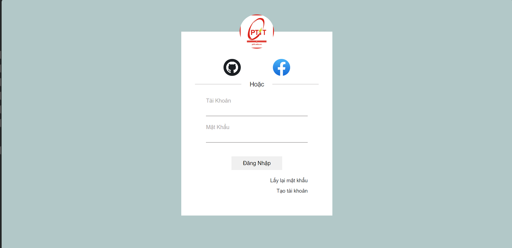
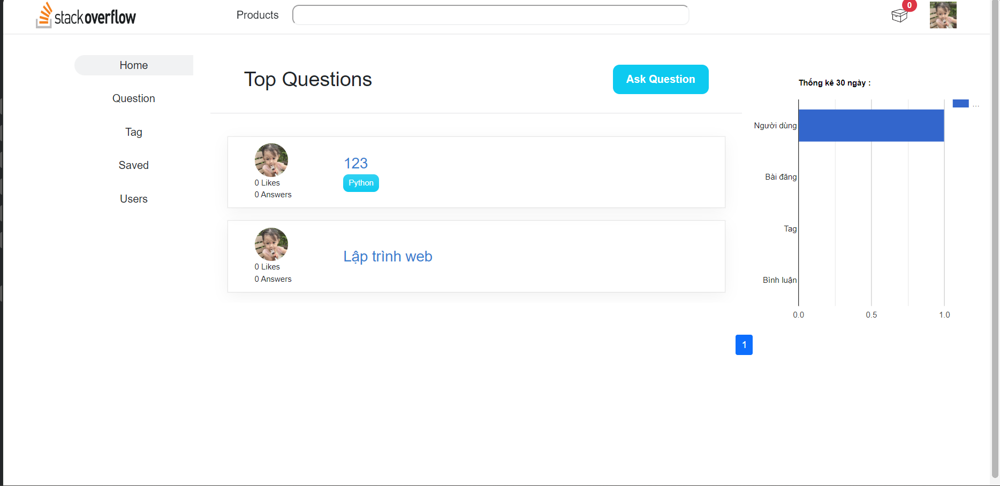
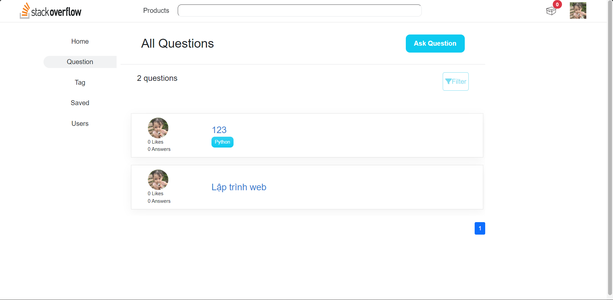
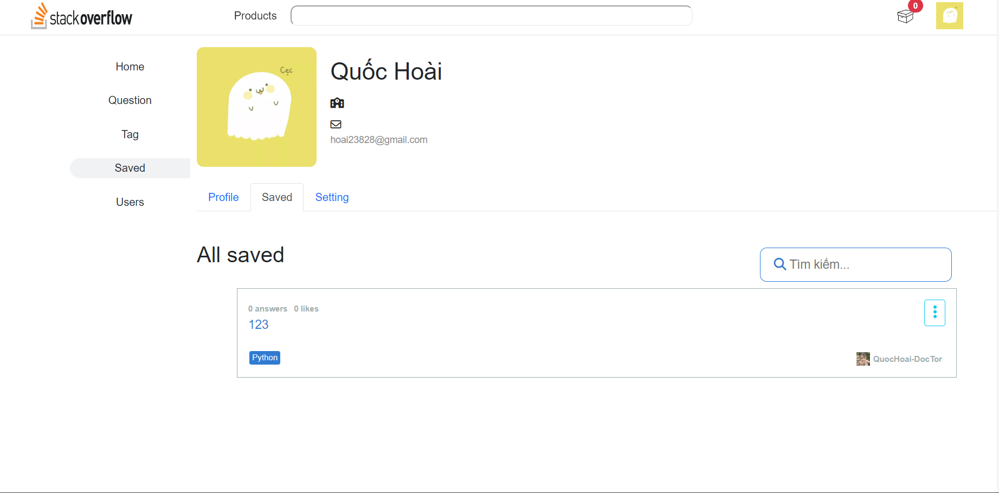
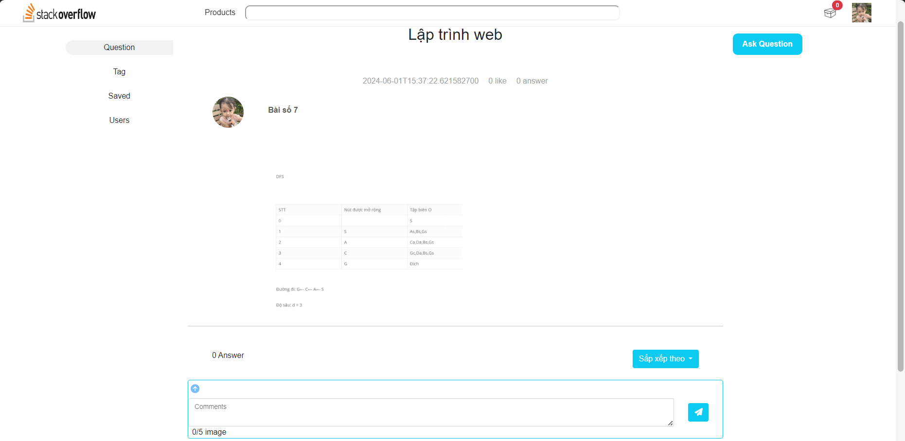
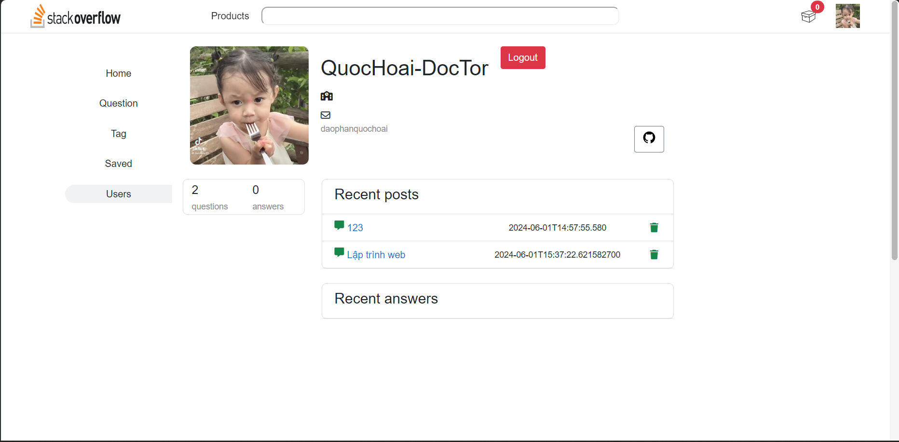
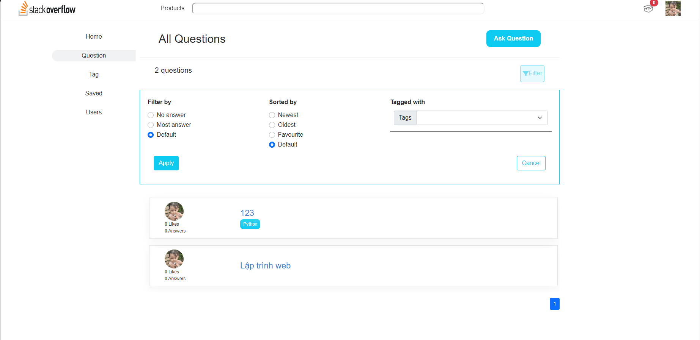
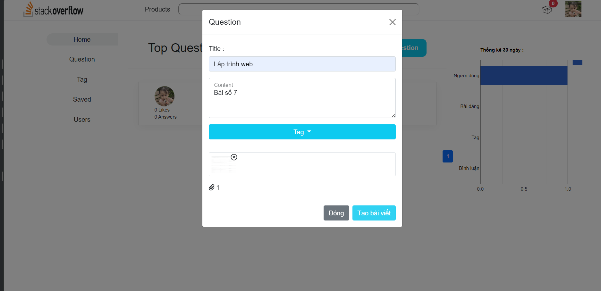
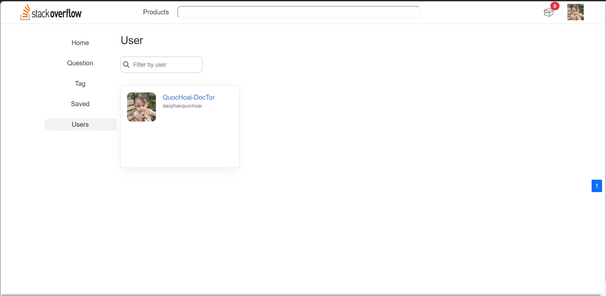

<h1>Đồ án môn lập trình web</h1>
<ul>
<li>Đào Phan Quốc Hoài</li>
</ul>

Công nghệ sử dụng :
<ul>
<li>Database : Sql Server</li>
<li>CACHING : Redis</li>
<li>Ngôn ngữ chính : Java</li>
<li>Framework : Spring boot, Thymeleaf</li>
<li>Front end : HTML, CSS, JS</li>
<li>Realtime : WebSocket</li>
</ul>

Trang login

Trang Home

Trang Question

Trang Tag

Trang Saved

Trang Chi Tiết Câu Hỏi

Trang Chi Tiết User

Cách lọc question

Thêm câu hỏi

Trang User

